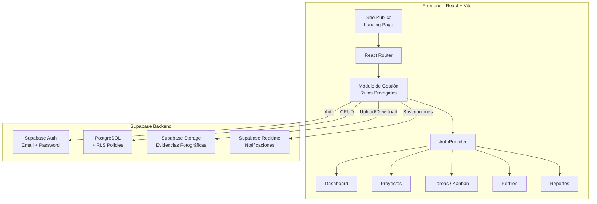
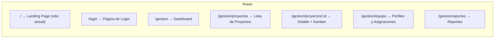
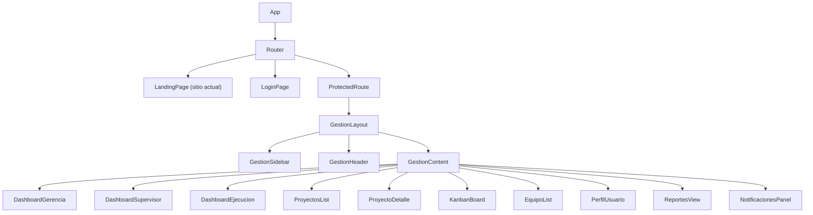
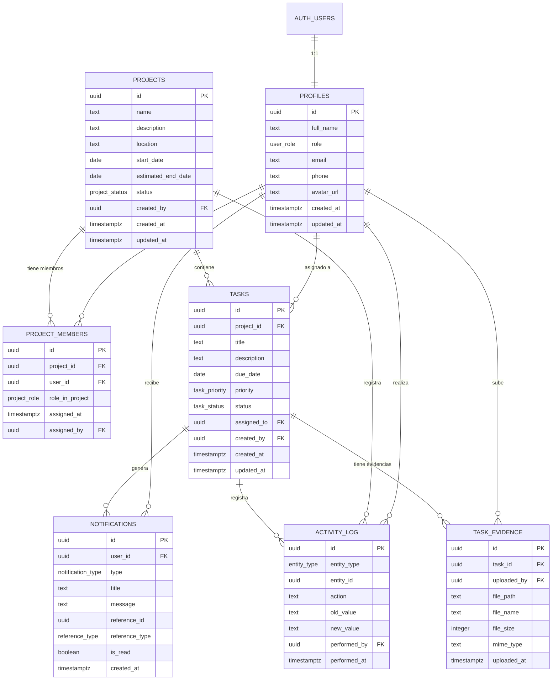

# Documento de Diseño Técnico — Sistema de Gestión de Proyectos

## Resumen General

Este documento describe el diseño técnico del Sistema de Gestión de Proyectos para **García Construcciones 503**. El sistema se integra al sitio web existente (React + Vite + Tailwind CSS + GSAP) como una sección protegida, utilizando **Supabase** como backend completo (PostgreSQL, Auth, Storage, Realtime).

### Decisiones Clave de Diseño

| Decisión | Elección | Justificación |
|----------|----------|---------------|
| Enrutamiento | React Router v6 | Permite rutas protegidas y lazy loading sin migrar a Next.js |
| Estado global | Zustand | Ligero, compatible con React 19, sin boilerplate excesivo |
| Backend | Supabase (PostgreSQL + Auth + Storage + Realtime) | Solución integrada que cubre autenticación, base de datos, almacenamiento y tiempo real |
| Seguridad BD | Row Level Security (RLS) | Seguridad a nivel de base de datos, independiente del frontend |
| Componentes UI | shadcn/ui (ya instalado) + Recharts | Consistencia con los componentes existentes del sitio |
| Almacenamiento de fotos | Supabase Storage con buckets privados | Acceso controlado por políticas, URLs firmadas temporales |

### Investigación Realizada

- **Supabase Auth**: Soporta autenticación por email/contraseña con JWT. Los roles personalizados se manejan mediante una tabla `profiles` vinculada a `auth.users`, ya que Supabase no soporta roles personalizados nativamente en el JWT sin funciones de base de datos.
- **Supabase Realtime**: Utiliza canales de PostgreSQL para suscripciones. Soporta filtros por tabla y por fila, ideal para notificaciones dirigidas a usuarios específicos.
- **Supabase Storage**: Permite buckets privados con políticas RLS. Las imágenes se sirven mediante URLs firmadas con expiración configurable.
- **React Router v6**: Se integra bien con Vite y permite code-splitting con `React.lazy()` para que el módulo de gestión no afecte la carga del sitio público.

---

## Arquitectura

### Diagrama de Arquitectura General



### Estrategia de Integración con el Sitio Existente

El sitio actual es una Single Page Application (SPA) sin enrutamiento. La integración se realiza así:

1. **Instalar React Router v6** en el proyecto existente.
2. **Envolver `App`** en un `BrowserRouter`.
3. **Ruta `/`**: Renderiza el sitio público actual (landing page).
4. **Ruta `/gestion/*`**: Renderiza el módulo de gestión con lazy loading.
5. **Agregar enlace** "Gestión de Proyectos" en la navegación principal (visible solo para usuarios autenticados o como enlace de login).



### Lazy Loading del Módulo de Gestión

```typescript
// En App.tsx - el módulo de gestión se carga solo cuando se necesita
const GestionModule = React.lazy(() => import('./gestion/GestionApp'));
```

Esto asegura que el sitio público no se vea afectado en rendimiento por el código del sistema de gestión.

---

## Componentes e Interfaces

### Jerarquía de Componentes



### Interfaces TypeScript Principales

```typescript
// === Tipos de Rol ===
type UserRole = 'gerencia' | 'supervisor' | 'ejecucion';

// === Perfil de Usuario ===
interface UserProfile {
  id: string; // UUID, FK a auth.users
  full_name: string;
  role: UserRole;
  email: string;
  phone: string | null;
  avatar_url: string | null;
  created_at: string;
  updated_at: string;
}

// === Proyecto ===
type ProjectStatus = 'planificacion' | 'en_progreso' | 'pausado' | 'completado';

interface Project {
  id: string;
  name: string;
  description: string;
  location: string;
  start_date: string;
  estimated_end_date: string;
  status: ProjectStatus;
  created_by: string; // FK a profiles.id
  created_at: string;
  updated_at: string;
  // Campos calculados (no en BD)
  progress_percentage?: number;
  task_counts?: TaskCounts;
}

interface TaskCounts {
  pendiente: number;
  en_progreso: number;
  completada: number;
  bloqueada: number;
  total: number;
}

// === Tarea ===
type TaskStatus = 'pendiente' | 'en_progreso' | 'completada' | 'bloqueada';
type TaskPriority = 'alta' | 'media' | 'baja';

interface Task {
  id: string;
  project_id: string; // FK a projects.id
  title: string;
  description: string;
  due_date: string;
  priority: TaskPriority;
  status: TaskStatus;
  assigned_to: string; // FK a profiles.id
  created_by: string;  // FK a profiles.id
  created_at: string;
  updated_at: string;
}

// === Evidencia Fotográfica ===
interface TaskEvidence {
  id: string;
  task_id: string;     // FK a tasks.id
  uploaded_by: string;  // FK a profiles.id
  file_path: string;    // Ruta en Supabase Storage
  file_name: string;
  file_size: number;    // En bytes
  mime_type: 'image/jpeg' | 'image/png';
  uploaded_at: string;
}

// === Notificación ===
type NotificationType =
  | 'task_assigned'
  | 'task_status_changed'
  | 'task_due_soon'
  | 'project_created'
  | 'project_status_changed';

interface Notification {
  id: string;
  user_id: string;      // FK a profiles.id (destinatario)
  type: NotificationType;
  title: string;
  message: string;
  reference_id: string;  // ID del proyecto o tarea relacionada
  reference_type: 'project' | 'task';
  is_read: boolean;
  created_at: string;
}

// === Historial de Cambios ===
interface ActivityLog {
  id: string;
  entity_type: 'project' | 'task';
  entity_id: string;
  action: string;        // e.g., 'status_changed', 'created', 'updated'
  old_value: string | null;
  new_value: string | null;
  performed_by: string;  // FK a profiles.id
  performed_at: string;
}

// === Asignaciones ===
interface ProjectMember {
  id: string;
  project_id: string;
  user_id: string;
  role_in_project: 'supervisor' | 'ejecucion';
  assigned_at: string;
  assigned_by: string;
}
```

### Componentes Clave de UI

#### 1. GestionLayout
Contenedor principal del módulo de gestión con sidebar colapsable, header con notificaciones y área de contenido.

#### 2. KanbanBoard
Tablero con 4 columnas (Pendiente, En Progreso, Completada, Bloqueada). Usa drag-and-drop para cambiar estado de tareas. Valida transiciones permitidas según el rol del usuario.

#### 3. DashboardGerencia
Panel con tarjetas de resumen por proyecto, gráficos de avance (Recharts), indicadores de proyectos con >20% de tareas bloqueadas, y lista de tareas vencidas.

#### 4. NotificacionesPanel
Dropdown en el header con lista de notificaciones. Contador de no leídas como badge. Se actualiza en tiempo real via Supabase Realtime.

#### 5. EvidenciaUploader
Componente de carga de imágenes con preview, validación de formato (JPEG/PNG) y tamaño (máx 10MB), y barra de progreso.

### Capa de API — Cliente Supabase

```typescript
// lib/supabase.ts
import { createClient } from '@supabase/supabase-js';
import type { Database } from './database.types';

const supabaseUrl = import.meta.env.VITE_SUPABASE_URL;
const supabaseAnonKey = import.meta.env.VITE_SUPABASE_ANON_KEY;

export const supabase = createClient<Database>(supabaseUrl, supabaseAnonKey);
```

#### Hooks de Datos (patrón consistente)

```typescript
// hooks/useProjects.ts — ejemplo del patrón
function useProjects() {
  const [projects, setProjects] = useState<Project[]>([]);
  const [loading, setLoading] = useState(true);

  useEffect(() => {
    // Carga inicial
    fetchProjects();

    // Suscripción en tiempo real
    const channel = supabase
      .channel('projects-changes')
      .on('postgres_changes', { event: '*', schema: 'public', table: 'projects' },
        (payload) => { /* actualizar estado local */ }
      )
      .subscribe();

    return () => { supabase.removeChannel(channel); };
  }, []);

  return { projects, loading };
}
```

#### Suscripciones en Tiempo Real para Notificaciones

```typescript
// hooks/useNotifications.ts
function useNotifications(userId: string) {
  useEffect(() => {
    const channel = supabase
      .channel(`notifications:${userId}`)
      .on('postgres_changes', {
        event: 'INSERT',
        schema: 'public',
        table: 'notifications',
        filter: `user_id=eq.${userId}`
      }, (payload) => {
        // Agregar notificación al estado y mostrar toast
      })
      .subscribe();

    return () => { supabase.removeChannel(channel); };
  }, [userId]);
}
```

---

## Modelos de Datos

### Diagrama Entidad-Relación



### Esquema SQL de PostgreSQL

#### Tipos Enumerados

```sql
CREATE TYPE user_role AS ENUM ('gerencia', 'supervisor', 'ejecucion');
CREATE TYPE project_status AS ENUM ('planificacion', 'en_progreso', 'pausado', 'completado');
CREATE TYPE task_status AS ENUM ('pendiente', 'en_progreso', 'completada', 'bloqueada');
CREATE TYPE task_priority AS ENUM ('alta', 'media', 'baja');
CREATE TYPE notification_type AS ENUM (
  'task_assigned', 'task_status_changed', 'task_due_soon',
  'project_created', 'project_status_changed'
);
CREATE TYPE entity_type AS ENUM ('project', 'task');
CREATE TYPE reference_type AS ENUM ('project', 'task');
CREATE TYPE project_role AS ENUM ('supervisor', 'ejecucion');
```

#### Tablas

```sql
-- Perfiles de usuario (vinculado a auth.users)
CREATE TABLE profiles (
  id UUID PRIMARY KEY REFERENCES auth.users(id) ON DELETE CASCADE,
  full_name TEXT NOT NULL,
  role user_role NOT NULL DEFAULT 'ejecucion',
  email TEXT NOT NULL,
  phone TEXT,
  avatar_url TEXT,
  created_at TIMESTAMPTZ NOT NULL DEFAULT now(),
  updated_at TIMESTAMPTZ NOT NULL DEFAULT now()
);

-- Proyectos
CREATE TABLE projects (
  id UUID PRIMARY KEY DEFAULT gen_random_uuid(),
  name TEXT NOT NULL,
  description TEXT NOT NULL,
  location TEXT NOT NULL,
  start_date DATE NOT NULL,
  estimated_end_date DATE NOT NULL,
  status project_status NOT NULL DEFAULT 'planificacion',
  created_by UUID NOT NULL REFERENCES profiles(id),
  created_at TIMESTAMPTZ NOT NULL DEFAULT now(),
  updated_at TIMESTAMPTZ NOT NULL DEFAULT now()
);

-- Miembros de proyecto (tabla de unión)
CREATE TABLE project_members (
  id UUID PRIMARY KEY DEFAULT gen_random_uuid(),
  project_id UUID NOT NULL REFERENCES projects(id) ON DELETE CASCADE,
  user_id UUID NOT NULL REFERENCES profiles(id) ON DELETE CASCADE,
  role_in_project project_role NOT NULL,
  assigned_at TIMESTAMPTZ NOT NULL DEFAULT now(),
  assigned_by UUID NOT NULL REFERENCES profiles(id),
  UNIQUE(project_id, user_id)
);

-- Tareas
CREATE TABLE tasks (
  id UUID PRIMARY KEY DEFAULT gen_random_uuid(),
  project_id UUID NOT NULL REFERENCES projects(id) ON DELETE CASCADE,
  title TEXT NOT NULL,
  description TEXT NOT NULL,
  due_date DATE NOT NULL,
  priority task_priority NOT NULL DEFAULT 'media',
  status task_status NOT NULL DEFAULT 'pendiente',
  assigned_to UUID NOT NULL REFERENCES profiles(id),
  created_by UUID NOT NULL REFERENCES profiles(id),
  created_at TIMESTAMPTZ NOT NULL DEFAULT now(),
  updated_at TIMESTAMPTZ NOT NULL DEFAULT now()
);

-- Evidencias fotográficas
CREATE TABLE task_evidence (
  id UUID PRIMARY KEY DEFAULT gen_random_uuid(),
  task_id UUID NOT NULL REFERENCES tasks(id) ON DELETE CASCADE,
  uploaded_by UUID NOT NULL REFERENCES profiles(id),
  file_path TEXT NOT NULL,
  file_name TEXT NOT NULL,
  file_size INTEGER NOT NULL CHECK (file_size > 0 AND file_size <= 10485760),
  mime_type TEXT NOT NULL CHECK (mime_type IN ('image/jpeg', 'image/png')),
  uploaded_at TIMESTAMPTZ NOT NULL DEFAULT now()
);

-- Notificaciones
CREATE TABLE notifications (
  id UUID PRIMARY KEY DEFAULT gen_random_uuid(),
  user_id UUID NOT NULL REFERENCES profiles(id) ON DELETE CASCADE,
  type notification_type NOT NULL,
  title TEXT NOT NULL,
  message TEXT NOT NULL,
  reference_id UUID NOT NULL,
  reference_type reference_type NOT NULL,
  is_read BOOLEAN NOT NULL DEFAULT false,
  created_at TIMESTAMPTZ NOT NULL DEFAULT now()
);

-- Historial de actividades
CREATE TABLE activity_log (
  id UUID PRIMARY KEY DEFAULT gen_random_uuid(),
  entity_type entity_type NOT NULL,
  entity_id UUID NOT NULL,
  action TEXT NOT NULL,
  old_value TEXT,
  new_value TEXT,
  performed_by UUID NOT NULL REFERENCES profiles(id),
  performed_at TIMESTAMPTZ NOT NULL DEFAULT now()
);
```

#### Índices

```sql
CREATE INDEX idx_project_members_project ON project_members(project_id);
CREATE INDEX idx_project_members_user ON project_members(user_id);
CREATE INDEX idx_tasks_project ON tasks(project_id);
CREATE INDEX idx_tasks_assigned_to ON tasks(assigned_to);
CREATE INDEX idx_tasks_status ON tasks(status);
CREATE INDEX idx_tasks_due_date ON tasks(due_date);
CREATE INDEX idx_task_evidence_task ON task_evidence(task_id);
CREATE INDEX idx_notifications_user ON notifications(user_id);
CREATE INDEX idx_notifications_unread ON notifications(user_id, is_read) WHERE is_read = false;
CREATE INDEX idx_activity_log_entity ON activity_log(entity_type, entity_id);
CREATE INDEX idx_activity_log_performed_by ON activity_log(performed_by);
CREATE INDEX idx_activity_log_performed_at ON activity_log(performed_at);
```

### Políticas de Row Level Security (RLS)

```sql
-- Habilitar RLS en todas las tablas
ALTER TABLE profiles ENABLE ROW LEVEL SECURITY;
ALTER TABLE projects ENABLE ROW LEVEL SECURITY;
ALTER TABLE project_members ENABLE ROW LEVEL SECURITY;
ALTER TABLE tasks ENABLE ROW LEVEL SECURITY;
ALTER TABLE task_evidence ENABLE ROW LEVEL SECURITY;
ALTER TABLE notifications ENABLE ROW LEVEL SECURITY;
ALTER TABLE activity_log ENABLE ROW LEVEL SECURITY;

-- === PROFILES ===
-- Todos los usuarios autenticados pueden ver perfiles
CREATE POLICY "profiles_select" ON profiles
  FOR SELECT TO authenticated USING (true);

-- Usuarios pueden editar su propio perfil
CREATE POLICY "profiles_update_own" ON profiles
  FOR UPDATE TO authenticated USING (id = auth.uid());

-- Gerencia puede editar cualquier perfil
CREATE POLICY "profiles_update_gerencia" ON profiles
  FOR UPDATE TO authenticated
  USING (EXISTS (SELECT 1 FROM profiles WHERE id = auth.uid() AND role = 'gerencia'));

-- === PROJECTS ===
-- Gerencia ve todos los proyectos
CREATE POLICY "projects_select_gerencia" ON projects
  FOR SELECT TO authenticated
  USING (EXISTS (SELECT 1 FROM profiles WHERE id = auth.uid() AND role = 'gerencia'));

-- Supervisores y ejecución ven solo sus proyectos asignados
CREATE POLICY "projects_select_members" ON projects
  FOR SELECT TO authenticated
  USING (EXISTS (
    SELECT 1 FROM project_members WHERE project_id = projects.id AND user_id = auth.uid()
  ));

-- Solo gerencia puede crear proyectos
CREATE POLICY "projects_insert_gerencia" ON projects
  FOR INSERT TO authenticated
  WITH CHECK (EXISTS (SELECT 1 FROM profiles WHERE id = auth.uid() AND role = 'gerencia'));

-- Solo gerencia puede editar proyectos
CREATE POLICY "projects_update_gerencia" ON projects
  FOR UPDATE TO authenticated
  USING (EXISTS (SELECT 1 FROM profiles WHERE id = auth.uid() AND role = 'gerencia'));

-- === TASKS ===
-- Usuarios ven tareas de sus proyectos asignados
CREATE POLICY "tasks_select_members" ON tasks
  FOR SELECT TO authenticated
  USING (EXISTS (
    SELECT 1 FROM project_members WHERE project_id = tasks.project_id AND user_id = auth.uid()
  ));

-- Gerencia ve todas las tareas
CREATE POLICY "tasks_select_gerencia" ON tasks
  FOR SELECT TO authenticated
  USING (EXISTS (SELECT 1 FROM profiles WHERE id = auth.uid() AND role = 'gerencia'));

-- Gerencia y supervisores del proyecto pueden crear tareas
CREATE POLICY "tasks_insert" ON tasks
  FOR INSERT TO authenticated
  WITH CHECK (
    EXISTS (SELECT 1 FROM profiles WHERE id = auth.uid() AND role = 'gerencia')
    OR EXISTS (
      SELECT 1 FROM project_members
      WHERE project_id = tasks.project_id AND user_id = auth.uid() AND role_in_project = 'supervisor'
    )
  );

-- Gerencia y supervisores pueden editar tareas del proyecto
CREATE POLICY "tasks_update_managers" ON tasks
  FOR UPDATE TO authenticated
  USING (
    EXISTS (SELECT 1 FROM profiles WHERE id = auth.uid() AND role = 'gerencia')
    OR EXISTS (
      SELECT 1 FROM project_members
      WHERE project_id = tasks.project_id AND user_id = auth.uid() AND role_in_project = 'supervisor'
    )
  );

-- Personal de ejecución puede actualizar estado de sus tareas asignadas
CREATE POLICY "tasks_update_assigned" ON tasks
  FOR UPDATE TO authenticated
  USING (assigned_to = auth.uid());

-- === NOTIFICATIONS ===
-- Usuarios solo ven sus propias notificaciones
CREATE POLICY "notifications_select_own" ON notifications
  FOR SELECT TO authenticated USING (user_id = auth.uid());

-- Usuarios pueden marcar sus notificaciones como leídas
CREATE POLICY "notifications_update_own" ON notifications
  FOR UPDATE TO authenticated USING (user_id = auth.uid());

-- === TASK_EVIDENCE ===
-- Miembros del proyecto pueden ver evidencias
CREATE POLICY "evidence_select_members" ON task_evidence
  FOR SELECT TO authenticated
  USING (EXISTS (
    SELECT 1 FROM tasks t
    JOIN project_members pm ON pm.project_id = t.project_id
    WHERE t.id = task_evidence.task_id AND pm.user_id = auth.uid()
  ));

-- Gerencia puede ver todas las evidencias
CREATE POLICY "evidence_select_gerencia" ON task_evidence
  FOR SELECT TO authenticated
  USING (EXISTS (SELECT 1 FROM profiles WHERE id = auth.uid() AND role = 'gerencia'));

-- Personal de ejecución puede subir evidencias de sus tareas
CREATE POLICY "evidence_insert_assigned" ON task_evidence
  FOR INSERT TO authenticated
  WITH CHECK (EXISTS (
    SELECT 1 FROM tasks WHERE id = task_evidence.task_id AND assigned_to = auth.uid()
  ));

-- === ACTIVITY_LOG ===
-- Gerencia ve todo el historial
CREATE POLICY "activity_select_gerencia" ON activity_log
  FOR SELECT TO authenticated
  USING (EXISTS (SELECT 1 FROM profiles WHERE id = auth.uid() AND role = 'gerencia'));

-- Supervisores ven historial de sus proyectos
CREATE POLICY "activity_select_supervisor" ON activity_log
  FOR SELECT TO authenticated
  USING (EXISTS (
    SELECT 1 FROM project_members pm
    WHERE pm.user_id = auth.uid()
    AND pm.role_in_project = 'supervisor'
    AND (
      (activity_log.entity_type = 'project' AND pm.project_id = activity_log.entity_id)
      OR (activity_log.entity_type = 'task' AND pm.project_id IN (
        SELECT project_id FROM tasks WHERE id = activity_log.entity_id
      ))
    )
  ));
```

### Funciones de Base de Datos

```sql
-- Función para calcular porcentaje de avance de un proyecto
CREATE OR REPLACE FUNCTION calculate_project_progress(p_project_id UUID)
RETURNS NUMERIC AS $$
  SELECT CASE
    WHEN COUNT(*) = 0 THEN 0
    ELSE ROUND((COUNT(*) FILTER (WHERE status = 'completada')::NUMERIC / COUNT(*)) * 100, 1)
  END
  FROM tasks WHERE project_id = p_project_id;
$$ LANGUAGE sql STABLE;

-- Función para obtener conteo de tareas por estado
CREATE OR REPLACE FUNCTION get_task_counts(p_project_id UUID)
RETURNS JSON AS $$
  SELECT json_build_object(
    'pendiente', COUNT(*) FILTER (WHERE status = 'pendiente'),
    'en_progreso', COUNT(*) FILTER (WHERE status = 'en_progreso'),
    'completada', COUNT(*) FILTER (WHERE status = 'completada'),
    'bloqueada', COUNT(*) FILTER (WHERE status = 'bloqueada'),
    'total', COUNT(*)
  )
  FROM tasks WHERE project_id = p_project_id;
$$ LANGUAGE sql STABLE;

-- Trigger para actualizar updated_at automáticamente
CREATE OR REPLACE FUNCTION update_updated_at()
RETURNS TRIGGER AS $$
BEGIN
  NEW.updated_at = now();
  RETURN NEW;
END;
$$ LANGUAGE plpgsql;

CREATE TRIGGER profiles_updated_at BEFORE UPDATE ON profiles
  FOR EACH ROW EXECUTE FUNCTION update_updated_at();
CREATE TRIGGER projects_updated_at BEFORE UPDATE ON projects
  FOR EACH ROW EXECUTE FUNCTION update_updated_at();
CREATE TRIGGER tasks_updated_at BEFORE UPDATE ON tasks
  FOR EACH ROW EXECUTE FUNCTION update_updated_at();

-- Trigger para registrar cambios de estado en activity_log
CREATE OR REPLACE FUNCTION log_status_change()
RETURNS TRIGGER AS $$
BEGIN
  IF OLD.status IS DISTINCT FROM NEW.status THEN
    INSERT INTO activity_log (entity_type, entity_id, action, old_value, new_value, performed_by)
    VALUES (
      TG_ARGV[0]::entity_type,
      NEW.id,
      'status_changed',
      OLD.status::TEXT,
      NEW.status::TEXT,
      auth.uid()
    );
  END IF;
  RETURN NEW;
END;
$$ LANGUAGE plpgsql SECURITY DEFINER;

CREATE TRIGGER projects_status_log AFTER UPDATE ON projects
  FOR EACH ROW EXECUTE FUNCTION log_status_change('project');
CREATE TRIGGER tasks_status_log AFTER UPDATE ON tasks
  FOR EACH ROW EXECUTE FUNCTION log_status_change('task');
```

### Estrategia de Almacenamiento de Fotos (Supabase Storage)

```sql
-- Crear bucket privado para evidencias
INSERT INTO storage.buckets (id, name, public) VALUES ('evidence', 'evidence', false);

-- Política: Personal de ejecución puede subir a sus tareas
CREATE POLICY "evidence_upload" ON storage.objects
  FOR INSERT TO authenticated
  WITH CHECK (
    bucket_id = 'evidence'
    AND (storage.foldername(name))[1] IN (
      SELECT t.id::TEXT FROM tasks t WHERE t.assigned_to = auth.uid()
    )
  );

-- Política: Miembros del proyecto pueden descargar evidencias
CREATE POLICY "evidence_download" ON storage.objects
  FOR SELECT TO authenticated
  USING (
    bucket_id = 'evidence'
    AND (storage.foldername(name))[1] IN (
      SELECT t.id::TEXT FROM tasks t
      JOIN project_members pm ON pm.project_id = t.project_id
      WHERE pm.user_id = auth.uid()
    )
  );
```

**Estructura de archivos en Storage:**
```
evidence/
  {task_id}/
    {timestamp}_{filename}.jpg
    {timestamp}_{filename}.png
```

**Flujo de carga:**
1. Frontend valida formato (JPEG/PNG) y tamaño (≤10MB).
2. Se sube a `evidence/{task_id}/{timestamp}_{filename}`.
3. Se crea registro en `task_evidence` con la ruta.
4. Para visualizar, se genera URL firmada con `supabase.storage.from('evidence').createSignedUrl(path, 3600)`.


---

## Propiedades de Correctitud

*Una propiedad es una característica o comportamiento que debe mantenerse verdadero en todas las ejecuciones válidas de un sistema — esencialmente, una declaración formal sobre lo que el sistema debe hacer. Las propiedades sirven como puente entre especificaciones legibles por humanos y garantías de correctitud verificables por máquinas.*

### Propiedad 1: Cálculo de porcentaje de avance

*Para cualquier* proyecto con una lista de tareas con estados aleatorios, el porcentaje de avance calculado debe ser igual a `(cantidad de tareas con estado 'completada' / cantidad total de tareas) * 100`, redondeado a 1 decimal. Si el proyecto no tiene tareas, el porcentaje debe ser 0.

**Valida: Requerimientos 2.8**

### Propiedad 2: Transiciones de estado válidas para Personal de Ejecución

*Para cualquier* par (estado_actual, estado_destino) de una tarea y un usuario con rol 'ejecucion', la transición debe ser permitida únicamente si coincide con una de las tres transiciones válidas: (pendiente → en_progreso), (en_progreso → completada), o (en_progreso → bloqueada). Cualquier otra combinación debe ser rechazada.

**Valida: Requerimientos 3.5**

### Propiedad 3: Autorización basada en roles

*Para cualquier* combinación de rol de usuario y acción del sistema, la función de autorización debe retornar `true` solo si el rol tiene permiso para esa acción según la matriz de permisos definida. Gerencia tiene acceso total, Supervisor tiene acceso a gestión de tareas en sus proyectos, y Personal de Ejecución solo puede actualizar el estado de sus tareas asignadas.

**Valida: Requerimientos 1.5**

### Propiedad 4: Redirección al dashboard según rol

*Para cualquier* usuario con un rol válido (gerencia, supervisor, ejecucion), la función de redirección post-login debe retornar la ruta del dashboard correspondiente a ese rol, y nunca una ruta de otro rol.

**Valida: Requerimientos 1.3**

### Propiedad 5: Validación de creación de entidades

*Para cualquier* conjunto de datos de proyecto o tarea generado aleatoriamente, la función de validación debe aceptar los datos solo si todos los campos obligatorios están presentes y son válidos (no vacíos, fechas coherentes). Datos con cualquier campo obligatorio faltante o inválido deben ser rechazados.

**Valida: Requerimientos 2.1, 3.1**

### Propiedad 6: Agrupación Kanban por estado

*Para cualquier* lista de tareas con estados aleatorios, la función de agrupación por estado debe producir exactamente 4 grupos (pendiente, en_progreso, completada, bloqueada), donde cada tarea aparece en exactamente un grupo y el grupo corresponde a su estado.

**Valida: Requerimientos 3.7**

### Propiedad 7: Correctitud de filtros

*Para cualquier* lista de elementos (tareas, miembros del equipo, o registros de actividad) y cualquier combinación de criterios de filtro, cada elemento en el resultado filtrado debe cumplir con todos los criterios activos, y ningún elemento que cumpla todos los criterios debe ser excluido del resultado.

**Valida: Requerimientos 3.8, 7.4, 8.5**

### Propiedad 8: Visibilidad de datos según asignación

*Para cualquier* usuario con rol supervisor o ejecución y cualquier conjunto de proyectos/tareas con asignaciones aleatorias, la función de filtrado por visibilidad debe retornar únicamente los proyectos donde el usuario es miembro (para supervisores) o las tareas asignadas al usuario (para personal de ejecución). Nunca debe incluir datos de proyectos/tareas no asignados.

**Valida: Requerimientos 2.7, 4.1**

### Propiedad 9: Validación condicional en cambio de estado

*Para cualquier* tarea que cambia a estado 'completada', la validación debe rechazar el cambio si no existe al menos una evidencia fotográfica asociada. *Para cualquier* tarea que cambia a estado 'bloqueada', la validación debe rechazar el cambio si no se proporciona un comentario no vacío (sin contar cadenas compuestas solo de espacios en blanco).

**Valida: Requerimientos 4.2, 4.6**

### Propiedad 10: Validación de archivos de evidencia

*Para cualquier* archivo con tipo MIME y tamaño aleatorios, la función de validación debe aceptar el archivo solo si el tipo MIME es 'image/jpeg' o 'image/png' Y el tamaño es menor o igual a 10,485,760 bytes (10 MB). Cualquier otra combinación debe ser rechazada.

**Valida: Requerimientos 4.4**

### Propiedad 11: Detección de tareas vencidas

*Para cualquier* tarea con una fecha límite y un estado aleatorios, la función `isOverdue` debe retornar `true` si y solo si la fecha límite es igual o anterior a la fecha actual Y el estado es diferente de 'completada'.

**Valida: Requerimientos 5.5**

### Propiedad 12: Detección de tasa alta de bloqueo

*Para cualquier* proyecto con un conjunto de tareas con estados aleatorios, la función `hasHighBlockedRate` debe retornar `true` si y solo si la proporción de tareas en estado 'bloqueada' respecto al total de tareas es mayor al 20%. Si el proyecto no tiene tareas, debe retornar `false`.

**Valida: Requerimientos 5.6**

### Propiedad 13: Destinatarios de notificaciones por cambio de estado

*Para cualquier* evento de cambio de estado de una tarea, la función que determina los destinatarios de la notificación debe incluir a todos los supervisores del proyecto de la tarea y a todos los usuarios con rol 'gerencia'. No debe incluir al personal de ejecución (excepto al asignado, en caso de asignación de tarea).

**Valida: Requerimientos 6.2, 3.6**

### Propiedad 14: Detección de tareas próximas a vencer

*Para cualquier* tarea con una fecha límite y un estado aleatorios, la función `isDueSoon` debe retornar `true` si y solo si faltan 24 horas o menos para la fecha límite Y el estado es diferente de 'completada'.

**Valida: Requerimientos 6.3**

### Propiedad 15: Conteo de notificaciones no leídas

*Para cualquier* lista de notificaciones de un usuario con valores aleatorios de `is_read`, el conteo de no leídas debe ser exactamente igual al número de notificaciones donde `is_read` es `false`.

**Valida: Requerimientos 6.5**

### Propiedad 16: Completitud del registro de actividad

*Para cualquier* cambio de estado en un proyecto o tarea, el registro generado en `activity_log` debe contener: el tipo de entidad correcto ('project' o 'task'), el ID de la entidad, el estado anterior, el estado nuevo, el ID del usuario que realizó el cambio, y una marca de tiempo. Ninguno de estos campos debe ser nulo.

**Valida: Requerimientos 2.6, 8.1, 8.2**

---

## Manejo de Errores

### Errores de Autenticación

| Escenario | Comportamiento |
|-----------|---------------|
| Credenciales inválidas | Mostrar mensaje "Correo o contraseña incorrectos" sin revelar cuál es incorrecto |
| Sesión expirada | Redirigir a `/login` con mensaje "Tu sesión ha expirado, por favor inicia sesión nuevamente" |
| Token JWT inválido | Cerrar sesión automáticamente y redirigir a `/login` |

### Errores de Red y Conexión

| Escenario | Comportamiento |
|-----------|---------------|
| Pérdida de conexión a Supabase | Mostrar banner de desconexión, reintentar cada 5 segundos (Req. 9.5) |
| Timeout en peticiones | Reintentar hasta 3 veces con backoff exponencial (1s, 2s, 4s), luego mostrar error |
| Error 500 del servidor | Mostrar mensaje genérico "Error del servidor, intenta de nuevo más tarde" |

### Errores de Validación

| Escenario | Comportamiento |
|-----------|---------------|
| Campos obligatorios vacíos | Resaltar campos con borde rojo y mensaje inline |
| Archivo de evidencia inválido | Mostrar toast con "Solo se aceptan imágenes JPEG o PNG de máximo 10 MB" |
| Transición de estado no permitida | Mostrar toast con "No tienes permiso para realizar este cambio de estado" |
| Completar tarea sin evidencia | Bloquear el cambio y mostrar "Debes subir al menos una evidencia fotográfica" |
| Bloquear tarea sin comentario | Bloquear el cambio y mostrar "Debes describir el motivo del bloqueo" |

### Errores de Autorización (RLS)

| Escenario | Comportamiento |
|-----------|---------------|
| Acceso a proyecto no asignado | RLS retorna lista vacía; UI muestra "No tienes proyectos asignados" |
| Intento de crear proyecto sin ser gerencia | RLS rechaza INSERT; UI muestra "No tienes permisos para crear proyectos" |
| Intento de editar tarea de otro proyecto | RLS rechaza UPDATE; UI muestra "No tienes permisos para editar esta tarea" |

### Manejo Global de Errores

```typescript
// lib/error-handler.ts
type AppError = {
  code: string;
  message: string;
  userMessage: string;
};

function handleSupabaseError(error: PostgrestError): AppError {
  // Mapear códigos de error de Supabase a mensajes amigables
  if (error.code === '42501') return { code: 'FORBIDDEN', message: error.message, userMessage: 'No tienes permisos para esta acción' };
  if (error.code === '23505') return { code: 'DUPLICATE', message: error.message, userMessage: 'Este registro ya existe' };
  if (error.code === '23503') return { code: 'REFERENCE', message: error.message, userMessage: 'No se puede eliminar porque tiene registros asociados' };
  return { code: 'UNKNOWN', message: error.message, userMessage: 'Ocurrió un error inesperado' };
}
```

---

## Estrategia de Testing

### Enfoque Dual: Tests Unitarios + Tests Basados en Propiedades

El sistema utiliza un enfoque dual de testing:

- **Tests unitarios (Vitest)**: Para ejemplos específicos, casos borde, integraciones y flujos de UI.
- **Tests basados en propiedades (fast-check + Vitest)**: Para verificar propiedades universales que deben cumplirse para todas las entradas válidas.

### Librería de Property-Based Testing

Se utilizará **fast-check** (`@fast-check/vitest` o `fast-check` con Vitest) como librería de PBT. fast-check es la librería estándar para PBT en TypeScript/JavaScript, con excelente soporte para generadores personalizados.

### Configuración

Cada test basado en propiedades debe:
- Ejecutar un mínimo de **100 iteraciones** por propiedad.
- Incluir un comentario de referencia al documento de diseño.
- Formato de tag: **Feature: project-management-system, Property {número}: {título}**

### Tests Basados en Propiedades (16 propiedades)

| Propiedad | Función Bajo Test | Generadores |
|-----------|-------------------|-------------|
| 1: Cálculo de avance | `calculateProgress(tasks)` | Lista de tareas con estados aleatorios |
| 2: Transiciones de estado | `isValidTransition(role, from, to)` | Pares de (estado_actual, estado_destino) |
| 3: Autorización por roles | `hasPermission(role, action)` | Combinaciones de (rol, acción) |
| 4: Redirección por rol | `getDashboardRoute(role)` | Roles válidos |
| 5: Validación de entidades | `validateProject(data)`, `validateTask(data)` | Datos parciales/completos aleatorios |
| 6: Agrupación Kanban | `groupByStatus(tasks)` | Listas de tareas con estados aleatorios |
| 7: Correctitud de filtros | `filterTasks(tasks, criteria)` | Listas + criterios aleatorios |
| 8: Visibilidad por asignación | `getVisibleProjects(user, projects, members)` | Usuarios, proyectos y asignaciones aleatorias |
| 9: Validación condicional | `validateStatusChange(task, newStatus, evidence, comment)` | Tareas con estados, evidencias y comentarios aleatorios |
| 10: Validación de archivos | `validateEvidence(file)` | Archivos con mime_type y tamaño aleatorios |
| 11: Tareas vencidas | `isOverdue(task, currentDate)` | Tareas con fechas y estados aleatorios |
| 12: Tasa de bloqueo | `hasHighBlockedRate(tasks)` | Listas de tareas con estados aleatorios |
| 13: Destinatarios de notificación | `getNotificationRecipients(event, members, users)` | Eventos, miembros y usuarios aleatorios |
| 14: Tareas próximas a vencer | `isDueSoon(task, currentDate)` | Tareas con fechas y estados aleatorios |
| 15: Conteo de no leídas | `countUnread(notifications)` | Listas de notificaciones con is_read aleatorio |
| 16: Completitud de activity_log | `createActivityLog(change)` | Cambios de estado aleatorios |

### Tests Unitarios (por módulo)

| Módulo | Tests de Ejemplo | Tests de Caso Borde |
|--------|-----------------|---------------------|
| Autenticación | Login exitoso, login fallido, logout | Sesión expirada, token inválido |
| Proyectos | CRUD completo por gerencia | Proyecto sin tareas, proyecto con todas las tareas completadas |
| Tareas | Crear tarea, editar tarea, cambiar estado | Tarea sin asignar, fecha límite pasada |
| Evidencias | Subir JPEG, subir PNG | Archivo de 0 bytes, archivo de exactamente 10MB, formato BMP |
| Notificaciones | Recibir notificación, marcar como leída | Sin notificaciones, todas leídas |
| Dashboard | Renderizar dashboard por rol | Proyecto sin tareas, usuario sin proyectos |
| Reportes | Generar reporte de proyecto | Proyecto sin historial, rango de fechas vacío |

### Tests de Integración

| Flujo | Descripción |
|-------|-------------|
| Flujo completo de tarea | Crear proyecto → Asignar equipo → Crear tarea → Cambiar estado → Subir evidencia → Completar |
| Notificaciones en tiempo real | Cambiar estado de tarea → Verificar que la notificación llega al supervisor |
| Autenticación E2E | Login → Navegar a dashboard → Verificar datos según rol → Logout |
| Carga de archivos | Subir imagen → Verificar en Storage → Generar URL firmada → Descargar |

### Estructura de Archivos de Test

```
app/src/
  gestion/
    __tests__/
      properties/           # Tests basados en propiedades
        progress.property.test.ts
        transitions.property.test.ts
        authorization.property.test.ts
        routing.property.test.ts
        validation.property.test.ts
        kanban.property.test.ts
        filters.property.test.ts
        visibility.property.test.ts
        status-change.property.test.ts
        evidence.property.test.ts
        overdue.property.test.ts
        blocked-rate.property.test.ts
        notifications.property.test.ts
        due-soon.property.test.ts
        unread-count.property.test.ts
        activity-log.property.test.ts
      unit/                 # Tests unitarios
        auth.test.ts
        projects.test.ts
        tasks.test.ts
        evidence.test.ts
        notifications.test.ts
        dashboard.test.ts
        reports.test.ts
      integration/          # Tests de integración
        task-flow.test.ts
        realtime.test.ts
        auth-e2e.test.ts
        storage.test.ts
```
